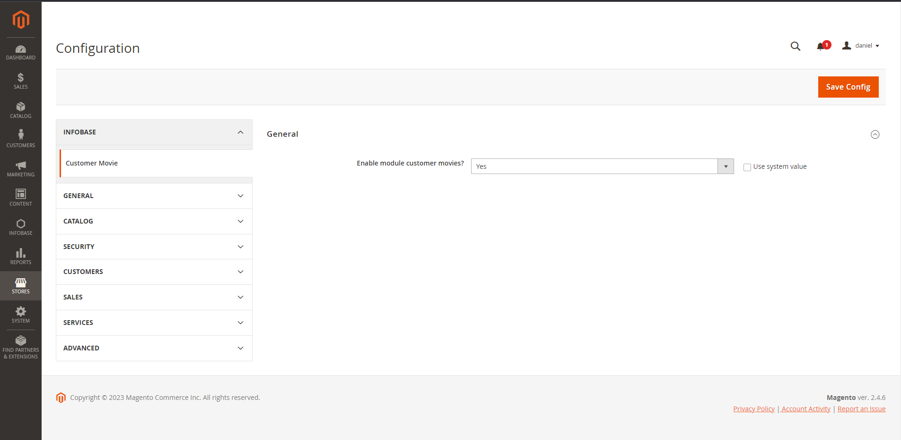
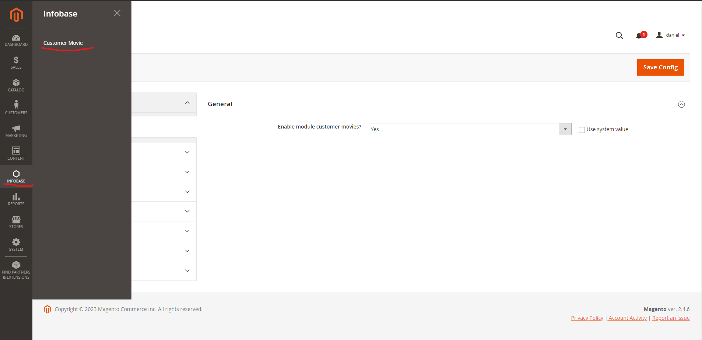
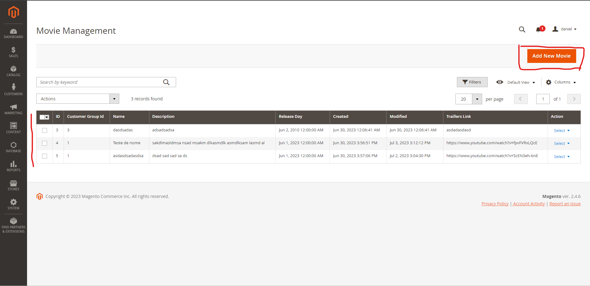
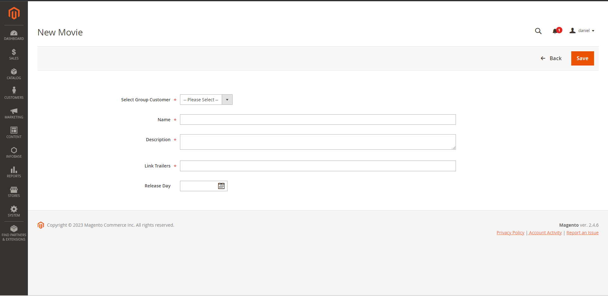
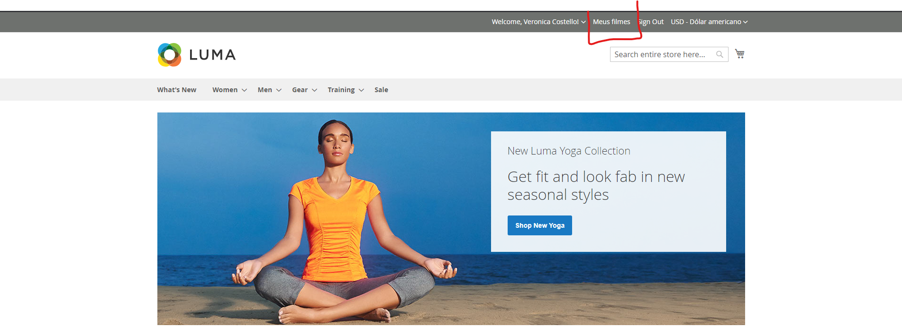
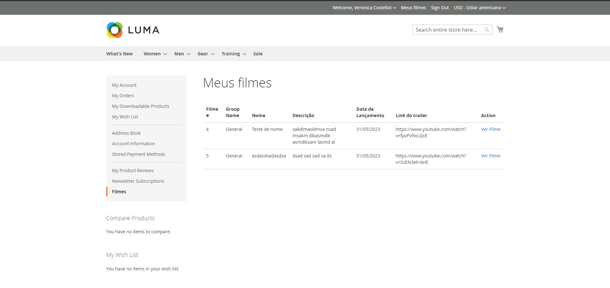
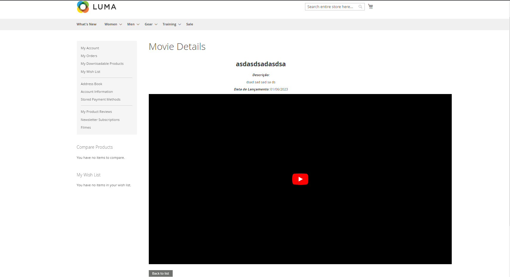

# Customer Movie


## Description

Module created to add information from several films related to a customer group.

The customer on his dashboard can see the movies that were assigned to the group he belongs to, see more details and watch the trailer.

## Compatibility

Magento 2.4.6

## Install

You can install the module in two ways.

1- Downloading the files:

```
1 Download the files and paste them into your magento project.
app/code/Infobase/CustomerMovie/<here>
```

2- Using composer
```
Within your magento project 2.4.6. run the command:
"composer require infobase/customermovie"
```


## Configurations

Setup is simple.
Just go to the module settings in the magento admin panel:

Stores -> Configuration -> Infobase -> Customer Movie and enable for module functionality.

Note: By default, the module is enabled.

## Usage

In admin panel of magento 2.4.6.
In the side menu there will be a new item called: "Infobase".
Click on it and open the submenu: "Customer Movie".

Here you will see a grid with the registered information.

To create a new one just click on: "Add New Movie". Fill in the fields and click save.

Steps for editing and deleting follow the same pattern as for magento modules.


Now on the frontend, log in as a customer.
You will see at the top a new menu called: "My Movies".
Clicking there you will be redirected to the client's dashboard where you will have a list with the registered films referring to your client group.

Clicking on: "View More".
You will see the information regarding the movie, and you will be able to watch the trailer of the movie if you registered the link in the admin in the act of creating the movie.

At the bottom of the screen, you'll see a button to go back to the movie list.

Note: Below are some reference images.

## Prints Demo
1

2

3

4

5

6

7



## Authors
Module created by the developer Daniel Souza for the company Infobase with testing purposes for hiring.
